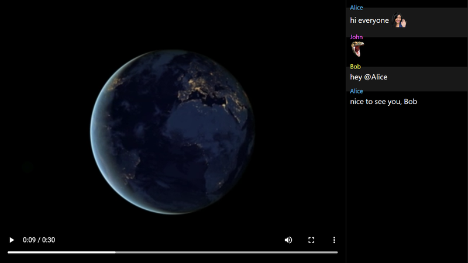
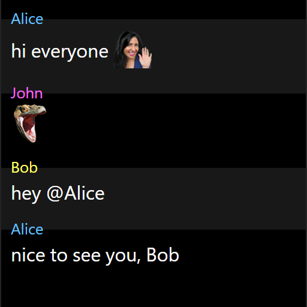
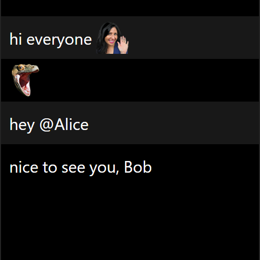

# Twitch VOD Offline Viewer

Most VODs on Twitch disappear sooner or later. Either because their availability expires or because they are explicitly deleted. So if you haven't finished watching the VOD in time, the content is gone. You can download the video, but what about the chat? "Twitch VOD Offline Viewer" solves this problem. Just download video + chat and play it just like a regular VOD at any time, even offline¹.



¹ Emotes in chat will only appear when images can be downloaded. So to see emotes, you still have to have an internet connection.

## Prerequisites

- [Node.js](https://nodejs.org/) runtime

## Step 1: Download the VOD's video stream

Recommendation: Use [TwitchDownloader](https://github.com/lay295/TwitchDownloader) to download the desired video, see "VOD Download" tab. But any other tool to download the VOD will do too.

<details>
	<summary>Supported video/audio codecs</summary>

Any codec that is supported by [your browser's `<video>` tag](https://developer.mozilla.org/en-US/docs/Web/HTML/Element/video).

</details>

## Step 2: Download the VOD's chat messages

Recommendation: Use [TwitchDownloader](https://github.com/lay295/TwitchDownloader) to download the corresponding chat, see "Chat Download" tab. **Select "Text" and "Relative".**

<details>
  <summary>Chat file format</summary>

If you generate the chat file by other means, the expected format is:

```
[0:00:01] Alice: hi everyone HeyGuys
[0:00:01] John: PogChamp
[0:00:03] Bob: hey @Alice
[0:00:07] Alice: nice to see you, Bob
```

- Timestamp in square brackets (hour can be one or two digits)
- Space
- Username, followed by a colon
- Space
- Message
- Newline

</details>

## Step 3: Move the downloaded files

- Move the downloaded video file to `/stream/video.mp4`. *(Replace the dummy file.)*
- Move the downloaded chat file to `/stream/chat.txt`. *(Replace the dummy file.)*

## Step 4: Start the chat server

Run `node chat.mjs` to start a Node.js HTTP server that will serve chat messages in your browser.

## Step 5: Open the webpage

Open `index.html` in your favorite browser.

## Step 6: Start watching

Pause anytime. The play position is remembered and restored automatically.

Use the `watch.bat` to resume (does step 4 and 5 for you).

## Optional: Channel emotes

In order to see channel specific emotes, you will need to specify the channel ID. There are many ways to retrieve this information, for example using the [Twitch Channel ID Finder](https://streamscharts.com/tools/convert-username).

### BetterTTV, FrankerFaceZ & 7TV

These emotes will be downloaded automatically whenever the chat server starts. Make sure you adjust the `CHANNEL_ID` variable at the top in the `chat.mjs` source file before running the server.

### TwitchTV

Global Twitch emotes are provided by default. However, exclusive streamer emotes must be provided manually due to requiring OAuth to access the [Twitch API](https://dev.twitch.tv/docs/irc/emotes/#getting-channel-emotes). Once authenticated, make the request and save the endpoint's response as `<CHANNEL_ID>.json` in `/emotes/`. Make sure you adjust the `CHANNEL_ID` variable at the top in the `chat.mjs` source file before running the server.

<details>
  <summary>How to work with the Twitch API</summary>

1. Create an app [via Twitch developer console](https://dev.twitch.tv/console/apps). This will yield a "Client-ID" and a "Client-Secret".

2. Request an access token using your `client_id` and `client_secret`:
```
curl -L 'https://id.twitch.tv/oauth2/token' \
     -H 'Content-Type: application/x-www-form-urlencoded' \
     -d 'grant_type=client_credentials' \
     -d 'client_id={{client_id}}' \
     -d 'client_secret={{client_secret}}'
```
3. Store the value of `access_token` from the response.

4. Fetch the channel's ID:
```
curl -L 'https://api.twitch.tv/helix/users?login={{channel_name}}' \
     -H 'Authorization: Bearer {{access_token}}' \
     -H 'Client-Id: {{client_id}}'
```
5. Store the value of `data[0].id` (`channel_id`) from the response.

6. Fetch the channel's emotes:
```
curl -L 'https://api.twitch.tv/helix/chat/emotes?broadcaster_id={{channel_id}}' \
     -H 'Authorization: Bearer {{access_token}}' \
     -H 'Client-Id: {{client_id}}'
```
7. Save the response to the file.

</details>

## Chat usernames

If you don't care about usernames in chat, change the `CHAT_USERNAMES` variable in the `index.html` source file to `false`.

| `CHAT_USERNAMES = true`  | `CHAT_USERNAMES = false` |
| ------------------------ | ------------------------ |
|  |  |

## Chat delay

Brief disconnects during the live stream cause the chat log to be out of sync. **Right-click on the video to show a dialog where you can enter the offset in seconds.** Chat messages will then appear either sooner (input < 0) or later (input > 0). You may change this at any time while watching.

## Troubleshooting

### Chat

If you are using an adblock extension in your browser, such as [uBlock Origin](https://github.com/gorhill/uBlock), the chat server communication might be blocked. This happens due to blocking connections from `localhost`. Either whitelist `localhost:8787` or temporary disable the extension.
